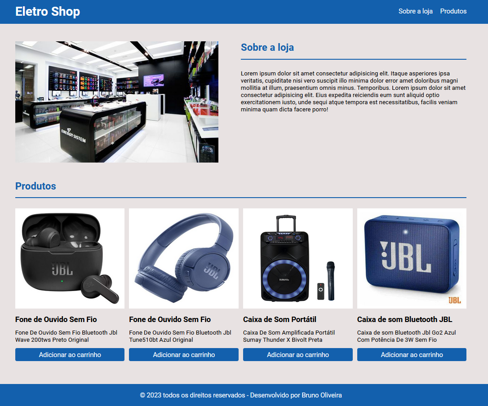

# 🏆 Eletro Shop

 

## 📎 Sumario

- 📌 Resumo do Projeto
- ⭐ Desafio
- 📂 Temas abordados
- ✔️ Tecnologias Utilizadas
- 💻 Demonstração
- 🙋🏻‍♂️ Autor

 

## 📌 Resumo do Projeto
Este projeto trata-se de um desafio para fazer um layout simples de uma loja virtual, que tem com objetivo explorar os conceitos de responsividade, foi feito com uma abordagem em display grid o layout desktop e tablet. respeitando os breakpoints estabelecidos.

 

## ⭐ Desafio
- Criar um layout responsivo de uma loja virtual;
- Criar uma seção “sobre a loja”, nesta seção teremos duas colunas uma com a imagem da loja e outra com um texto;
- Criar uma seção de produtos onde haverá uma listagem de 4 produtos, lado a lado, com a imagem, nome e descrição do produto e um botão para adicionar ao carrinho;
- Seguir as adaptações de layout propostas e fazer a publicação na Vercel;

 

## 📂 Temas abordados
- HTML Semântico
- CSS com Display Grid
- Utilização de Media Queries
- Unidades de medida responsiva
- Deploy na Vercel

 

## ✔️ Tecnologias Utilizadas

 

## 💻 Demonstração
Para visualizar uma prévia do projeto <a href="https://eletro-shop.vercel.app/" target="_blank"><b>clique aqui</b></a>

 

## 🙋🏻‍♂️ Autor
| [ Bruno Oliveira](https://github.com/BrunoOliveira16) |
| :---: |
